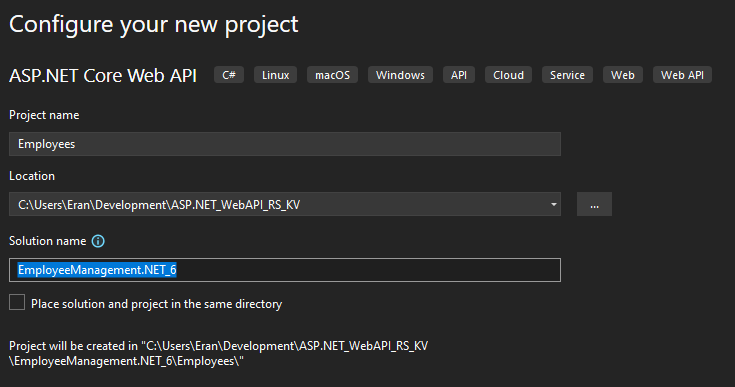
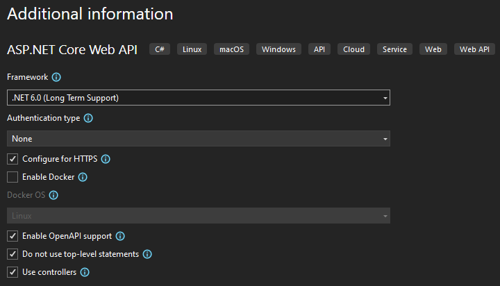

# EmployeeManagement.NET_6
[go to table](#02-webapi-basic-conceptes)
## 01 Creating Empty Project

- Creating a new Web API Project via VS2022.
	- Didn't use Top Level Statement. (Use main method)
	- didn't use minimal API (Use Controllers)
	- Didn't choose Authentication method like Microsoft Identity Server.
	- Leave, for now, the default WeatherForcast Controller.
	  
	  
	- As we set *Enable OpenAPI Support* it includes the *Swashbuckle.AspNetCore* Nuget package. [Nuget Package location](https://stackoverflow.com/questions/40902578/wheres-the-nuget-package-location-in-asp-net-core)
- Solution & Project changes
	- The format and content of the **.csproj** has changed significantly (from .NET Framework) 
		- Ability to edit the project file without unloading it from solution explorer
		- The project file does not contain any folder or file reference.
		- The File System determines what files and folders belong to the project.
			- All files and folders that are present in the project root folder are part of the project and will be displayed in the solution explorer.
- Content of the Project File
	- TFM, (Target Framework Moniker): specify the target framework for your application
	
		| Name         | Abbreviation | TFM  |
		|--------------|--------------|------| 
		|.NET Framework|net           |net472|
		|              |              |net48 |
		|.NetCore      |netcoreapp    |netcoreapp2.2|
		|              |              |netcoreapp3.1|
		|              |net           |net5.0|
		|              |              |net6.0|

## 02 WebAPI Basic Conceptes

- [Importand Aspects of HTTP](slides/http_recap.md)
- [WebAPI Basic Concepts](slides/basic_concepts.md)
- [Depandancy Injection](slides/dependency_injection.md)
- [Controllers](slides/controller.md)
- [Model Bindings](slides/model_bindings.md)
- [Routing](slides/routing.md)
  - [Attribute vs Flters](slides/AttributesVSFilters.md)
