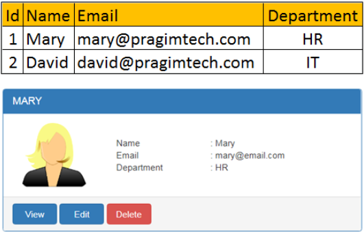

# Web API Basic Concepts

- Assume we want to get Employee details from Employees database table and display on the web page as shown below:
  
- To represent the employee data, we will create the following Employee class:
  ```c#
  public class Employee
  {
      public int Id { get; set; }
      public string? Name { get; set; }
      public string? Email { get; set; }
      public string? Department { get; set; }  
  }
  ```
- In addition to the Employee class that represent the data, we need a class that manages the model data. We will create an interface to a data model service named IEmployeeRepository. 
- At the moment, we only have one method GetEmployee(int id) that retrieves employee by ID:
  ```c#
  public interface IEmployeeRepository
  {
      Employee GetEmployeeById(int id);
  }
  ```
- We will implement a MockEmployeeRepository that provides the implementation for IEmployeeRepository interface. Currenly we will use a memory list for the employees.
  ```c#
  public class MockEmployeeRepository : IEmployeeRepository
  {
      private readonly List<Employee> _employeeRepository;  
      public MockEmployeeRepository()
      {
          _employeeRepository = new List<Employee>() {
              new Employee() { Id = 1, Name = "Mary", Department = "HR", Email = "mary@pragimtech.com" },
              new Employee() { Id = 2, Name = "John", Department = "IT", Email = "john@pragimtech.com" },
              new Employee() { Id = 3, Name = "Sam", Department = "IT", Email = "sam@pragimtech.com" },
          };
      }
      public Employee GetEmployeeById(int Id)
      {
          Employee employee =  _employeeRepository.FirstOrDefault(e => e.Id == Id);
          return employee;
      }
  }
  ```
 - Working against the interface allows us to use [dependency injection](dependency_injection.md) which in turns make our application flexible an easily unit testable.
 - We will user *dependency injection* in our *Controller* but first let's understand [What is a Controller](controller.md)
 - Lets create our first Controller - EmployeeController, and use our IEmployeeRepository in this controller.
   - Create a constructor and inject the IEmployeeRepository in it.
   - Store it in a private field.
   - Use it in the *GetEmployeeById* method and call *IEmployeeRepository's GetEmployeeById* method.
    ```c#
    [ApiController]
	  [Route("[controller]")]
	  public class EmployeeController : ControllerBase
	  {
        
        IEmployeeRepository _employeeRepository;
        public EmployeeController(IEmployeeRepository employeeRepository)
        {
            _employeeRepository = employeeRepository;
        }
        
        [HttpGet]
        [Route("{id:int}")]
        public Employee GetEmployeeById(int id) 
        {
            return _employeeRepository.GetEmployeeById(id);
        }
    }
    ```

**Bibliography:**

[Taken from: ASP.NET core tutorial for beginners](https://www.youtube.com/playlist?list=PL6n9fhu94yhVkdrusLaQsfERmL_Jh4XmU)

[Model in ASP NET Core MVC](https://www.youtube.com/watch?v=KXPbJ9I4ce0&list=PL6n9fhu94yhVkdrusLaQsfERmL_Jh4XmU&index=19)

[](https://www.youtube.com/watch?v=KXPbJ9I4ce0&list=PL6n9fhu94yhVkdrusLaQsfERmL_Jh4XmU&index=18)


