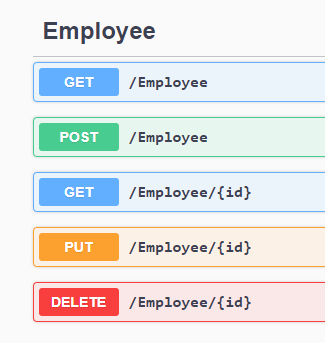

# Controllers

#### What is a Controller

- A controller gather together, in a simple class, all c# methods that implement a set of logically connected web  APIs. We put together things that logically belong together in a single class and we call this class a controller.
- The controller in a Web API **inherits from ControllerBase.** This marks this class to be ASP.NET Core Controller. ControllerBase is the base class for all API Controllers.
- Additionally, in order to tell ASP.NET Core that we really want to write Web API, we need to specify the attribute **[ApiController]**
  ```c#
  [ApiController]
  public class EmployeeController : ControllerBase
  {

  }
  ```
#### What are attributes

- Attributes are passive addition to the class, they don't implement code. Can influence how code executed. This attribute can be interpreted by  somebody. (for example by reflection)
- Example of attribute is the one mentioned above **[ApiController]** - attribute that tells the interpreter to treat this class differently, i.e. as a controller.
- Another common attributes in the controller class are **Route Attributes** which specify where the controller should be available in terms of HTTP path. For example:
  - For the whole *Controller*, we can use:
    - **[Route("[controller]")]** - Token attribute.  When we say controller in the path we mean to use the name of the class, for example, the Class *EmployeeController*, without the suffix controller. I.e, we can navigate to **http://localhost:5000/employee**
    - **[Route("api/employee")]** - We can specify our own route to the whole controller. I.e we can navigate to **http://localhost:5000/api/employee**  
  - For Action, we can also add routes:
    - **[Route("item")]** - we need a route also to the action. 
    - **[Rout("[action]")]**  - Same we can specify the action keyword for the methods. 
    - **[Route("[controller]/[action]")]** - or we can combine theme togeter
 
- [Pay attention to diference between Attributes and Filters](AttributesVSFilters.md)
- Lets add some APIs:
  - We want to make the Employee's list availabe to the WebAPI, so we add a function *GetAllEmployees*, adding the attribute **[HttpGet]**, and return the http status code, **Ok** in our case, and give it the content of the result.
  - The return type is *IActionResult*. which is encapsulation of status code and content.
  - Of course we've added to the EmpolyeeRepository interface and implementation the corresponding metod.
  ```c#
  namespace Employees.Controllers
  {
      [ApiController]
      [Route("[controller]")]
      public class EmployeeController : ControllerBase
      {
          private readonly IEmployeeRepository _employeeRepository;
          public EmployeeController(IEmployeeRepository employeeRepository)
          {
              _employeeRepository = employeeRepository;
          }

          [HttpGet]
          public IActionResult GetAllEmployees()
          {
              return Ok(_employeeRepository.GetAllEmployees());
          }

          [HttpGet]
          [Route("{id:int}")]
          public Employee GetEmployeeById(int id)
          {
              return _employeeRepository.GetEmployeeById(id);
          }
      }
  }
  ```
  - To get *EmployeeList* according current *routing rules* we use: https://localhost:7156/employee
  - We already added the method *GetEmployeeById*, lets refine it with some validation checks, if null is returned from the list the API returns BadRequest.
    ```c#
    [HttpGet]
    [Route("{id:int}")]
    public IActionResult GetEmployeeById(int id)
    {
        Employee? employee = _employeeRepository.GetEmployeeById(id);
        if (employee != null)
            return Ok(employee);
        else
            return BadRequest("No Such Id");
    }
    ```
    - In the **Route** attribute there is a  curly braces. Theas means that inside of it, it is a variable that refers the first parameter of the method. We will talk about it in the [routing](routing.md) page.  
  
  - Now lets add the method *AddEmployee*
    ```c#
    [HttpPost]
    public IActionResult AddEmployee([FromBody] Employee newEmployee) 
    {
        Employee addedEmployee = _employeeRepository.AddEmployee(newEmployee);
        return CreatedAtRoute("GetSpecificEmployee", new { Id = addedEmployee.Id }, addedEmployee);
    }
    ```
    - We set the **[HttpPost]** attribute, it is an *insert*. We add an **Employee**
    - We also *decorate* the parameter with attribute **[FromBody]**. This means, takes the new Employee item from the **HTTP Body**
    - We return value using the *CreatedAtRoute* mehtod. It is good practice to return the *location* header, so we will be able to get the newly created Emloyee. The first paremeter to the method is the *Name* atribute at the method that brings the item, so we have to add *Name* to the *GetEmployeeById* method.
    - We actually say, there is a **Route**, named **GetSpecificEmployee** that we can query the new added item, giving its index for this route. The last parameter will be returned as a response body. Usually, it is just the value of newly created resource.
    - **More reading and explanations:** [Created, CreatedAtAction, CreatedAtRoute Methods In ASP.NET Core Explained With Examples](https://ochzhen.com/blog/created-createdataction-createdatroute-methods-explained-aspnet-core)  

  - Lets add the *UpdateEmployee* method
    ```c#
    [HttpPut]
    [Route("{id:int}")]
    public IActionResult UpdateEmpoyee(int id, [FromBody] Employee updatedEmployee)
    {
        Employee? employee = _employeeRepository.UpdateEmploeye(id, updatedEmployee);
        if (employee != null)
            return Ok(employee);
        else
            return BadRequest($"No Employee with  Id: {id}");

    }
    ```
    - In this method we use the **[HttpPut]** attribute
    - We are combining the *Route* parameter, **id**, with the data from **[FromBody]** attribute. This is because we want to update specific item.
  - *DeleteEmployee* will look like this:
    ```c#
    [HttpDelete]
    [Route("{id:int}")]
    public IActionResult DeleteEmployee(int id)
    {
        if (_employeeRepository.DeleteEmployee(id))
        {
            return NoContent();
        }
        else
        {
            return BadRequest($"No Employee with Id: {id}");
        }
    }
    ```
  - As we saw the **[FromBody]** attribute that tells .net that the data comes from the body of the requeset, we can set the attribute **[From Query]** to indicate, for a parameter, that it comes from the query string.
 - As you can see, the CRUD API we created, can be distinguished according the *VERB* we send and the paremeter:
     
    - Get the list of Employees uses **GET https://localhost:7156/employee** wheras update employee uses **POST https://localhost:7156/employee**. Both URLs are the same.
    - We can add a route with name that implies the operation. If we want the default route to remain we need to add **[Route("")]**
      ```c#
      [HttpGet] 
      [Route("")]
      [Route("all")]
      public IActionResult GetAllEmployees()
      {
          return Ok(_employeeRepository.GetAllEmployees());
      } 
      ```
    - Now we can get the employee list with the following calls:
      - **GET https://localhost:7156/employee**
      - **GET https://localhost:7156/employee/all**

[Back to Table of Content](../README.md#02-webapi-basic-conceptes)   
  
**Bibliography:**


[](https://www.youtube.com/watch?v=-O0UYM0ZIIc&list=PL6n9fhu94yhVkdrusLaQsfERmL_Jh4XmU&index=20&pp=iAQB)

[HTL Perg: Mobile Computing and C# Course - Part 2 (ASP.NET Core Fundamentals) **44:36**](https://www.youtube.com/watch?v=SpXNoqPJDwU&list=PLhGL9p3BWHwtV_hn6H_uZ4vrFE3F7mY8a&index=2&t=2725s&pp=iAQB)

[](https://www.youtube.com/watch?v=SpXNoqPJDwU&list=PLhGL9p3BWHwtV_hn6H_uZ4vrFE3F7mY8a&index=2&t=2725s&pp=iAQB)

[C# ASP.NET 5 - Dependency Injection, RESTful Web APIs, Generating Swagger **18:48**](https://www.youtube.com/watch?v=ksy8LK5M1Ts&list=PLhGL9p3BWHwtHPWX8g7yJFQvICdNhFQV7&index=26&t=1128s&pp=iAQB)

[](https://www.youtube.com/watch?v=ksy8LK5M1Ts&list=PLhGL9p3BWHwtHPWX8g7yJFQvICdNhFQV7&index=26&t=1128s&pp=iAQB)

- The sides for this are taken from the mobile course:
  - [htl-mobile-computing-5](https://github.com/rstropek/htl-mobile-computing-5) given in 2019/20, [slides](https://htl-mobile-computing-5.azurewebsites.net/#/)
  - [htl-mobile-computing](https://github.com/rstropek/htl-mobile-computing) given in 2018/19, [slides](https://rstropek.github.io/htl-mobile-computing/#/). This is an older version of the same course, includes lot of issues that are missing in the first github repository.
