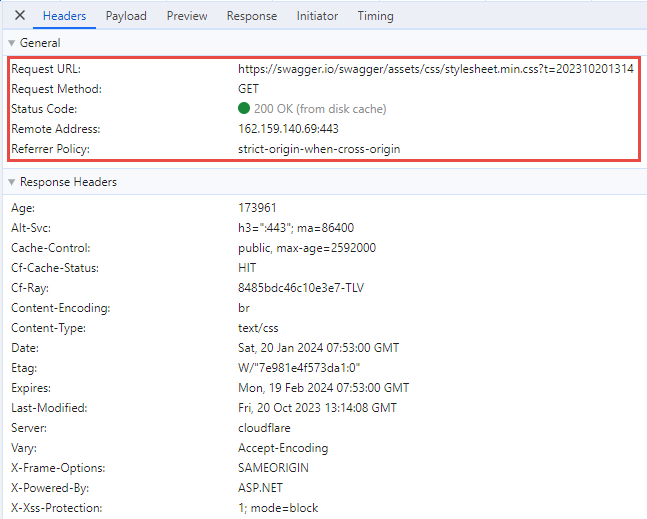

# Importand Aspects of HTTP

- Web APIs are **APIs that are based on the HTTP protocol** [What is HTTP Protocol?](https://www.youtube.com/watch?v=qBqxYZmwqPY&list=PLhGL9p3BWHwtlclHZ4KMuJGtiI5hj7dWG)
- There are other kinds of RPC like:
  - gRPC
  - WebSockets
  - SignalR
  - WCF
  - etc.
- In Chrome Dev Tools we can see what http consist of 
   
  - URL - every http request has a URL
  - *Request Method* or *Verb* can be one of the following types:
    - Post - reading data
    - Get - reading data
    - Delete - deleating data
    - Put - update data, update an entire record
    - Patch - update data, partial data
    - etc.
  - Status code - Wether the server can successfuly process the request, there are lot of status codes, those can be found:
    - [List of HTTP status codes](https://en.wikipedia.org/wiki/List_of_HTTP_status_codes) 
    - and also here: [HTTP Cats](https://http.cat/)
    - and here: [Http Status Dogs](https://httpstatusdogs.com/)
    - Few issues regarding stauts codes: 
      - The fist digit of a status code indicates teh general type of response: 
        - 1xx informational response – the request was received, continuing process
        - 2xx successful – the request was successfully received, understood, and accepted
        - 3xx redirection – further action needs to be taken in order to complete the request, (things you are looking for in no longer presented here, please go there where you can find it)
        - 4xx client error – the request contains bad syntax or cannot be fulfilled
        - 5xx server error – the server failed to fulfil an apparently valid request
      - Most important status codes are:
        - 1xx Informational responces 
          - In this group we will talk only about 101
          - 101 Switching Protocols - The requester has asked the server to switch protocols and the server has agreed to do so. Importand when we are talking about **Web Sockets** - duplex porotocol where server and clients can talk to each other in both directions. Web Sockets are initiated using the http protocol, first client sends http requst for talking Web Sockets with the server, when the server is O.K. with that, it responce 101.
        - 2xx successess - main responces are:
          - 200 OK - Successful.
          - 201 Created - Server created resource requested by the client. Genrerally response after POST request
          - 202 Accepted - is used when we are doing Async processing. Long operations are not immediately done by the server, they are scheduled to be activated later. In such case server returns *accepted*
          - 204 No Content - is returned, the resource exist but there is no content available. Usuelly returned when client request a DELETE method, for deleting a resouce, server returns indication the deletion succedded but there is no content to return.
        - 3xx redirection - the important ones are:
          - 301 Moved Permanently - If we build an API and over time we decided to change the API **URL structure**. (for example, paremeter of query string named differenlty).
          - 307 Temporary Redirect - Same as above 301 but only temporary.
        - 4xx client errors - More Important.
          - 400 Bad request - returned whenever a clinet sends request that doesn't make sence. 
          - 401 Unauthorized - Very close to 403 forbidden. The request is O.K. but the requester, as a user, is not allowed to do so. You don't have neccessary credential for doing this. 
          - 403 Forbidden - server refuse to do the request. I know the request, but this is not allowed. You can also use 405
          - 405 Method not allowed
        - 5xx server errors
          - 500 Internal Server Error - something bad happen in server side, for example, db is not available.
          - 501 Not Implemented - API method not implemented **yet**
  - Response Headers & Request Headers
    - Those are key / value pairs that the browser sends, (Reqeust headers), and the server resonse, (Response headers).
    - Importand request headers that are typically send to the server:
      - Accept - a client can send to the server what data format of response he can accept. for example, application/json, application/xml, */* etc.
      - Authorized - sending identity information to the server
    - With responde header, server can send additional information back to the client. One of the most important is **Coockies**, and the client will than send those Cookies to the server.
      - Cookies - are sent from the server to the client, and the client, when he visits the same server again, sends those cookies, (which originally recieved from the server), back to the server. In this way the server can related different requests to the same origin, and round trip some data.
      - In Web APIs, Cookies are often used for authentication. After login with user/password, the server set an encrypted cookie in the response header, and when the client calls the next API, the brouser will send the cookie with the identity information to the server and with that the server knows who the user is. The cookie of cours is digitaly signed so it is secured.
      - Client can also send Query Parameters after a **'?'** and those Query Parmas can be separated by **'&'** sign.

**Bibliography:**

[Recap Important Aspects Of HTTP](https://www.youtube.com/watch?v=ODfdeRUov4I&list=PLhGL9p3BWHwtHPWX8g7yJFQvICdNhFQV7&index=29)

Summary of lecture from [HTL Leonding C# Course 2020/21](https://www.youtube.com/playlist?list=PLhGL9p3BWHwtHPWX8g7yJFQvICdNhFQV7)
- Relevant Github is [htl-leo-csharp-4](https://github.com/rstropek/htl-leo-csharp-4)
