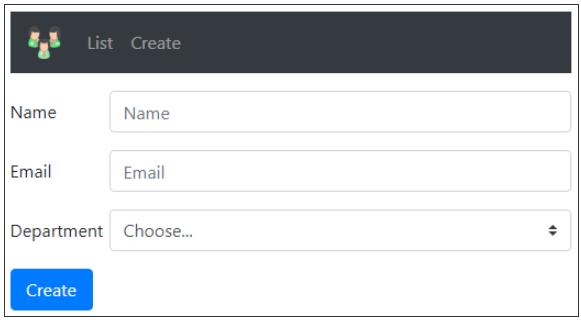

# Model Bindings

- Model binding maps data in an HTTP request to controller action method parameters, (i.e. in the QuereyString, Route Data, or Object past through Post requests).
- The action parameters may be simple types such as integers, strings, etc or complex types like Customer, Employee, Order etc.
- Model binding is great, because without it we have to write lot of custom code to map request data to action method parameters which is not only tedious but also error prone.

#### ASP.NET Core Model Binding Example

- When an HTTP request arrives at our Web API application it is the Controller action method that handles the incoming request. Let's say we want to view employee details whose ID is 2. For this we issue a GET request to the following URL: https://localhost:7156//employee/2
- Our application attribute route rules as shown in the Controller class bellow, routes this request to **GetEmployeeById(int id)** action method of the EmployeeController:
  ```c#
  [HttpGet]
  [Route("{id:int}", Name = "GetSpecificEmployee")]
  public IActionResult GetEmployeeById(int id)
  {
       Employee? employee = _employeeRepository.GetEmployeeById(id);
       if (employee != null)
           return Ok(employee);
       else
           return BadRequest($"No Employee with  Id: {id}");
  }  
  ```
  - The id value 2 in the request URL is mapped to the id parameter of the *GetEmployeeById(int id)* action method. The Web API of .NET will bind the data in the request to the action parameters by name. Notice, in the above example, the parameter name in the attribute route template is "id" and the parameter name on the *GetEmployeeById(int id)*  action method is also id. So the value 2 in the URL (https://localhost:7156//employee/2) is mapped to the id parameter on the *GetEmployeeById(int id)*  action method.
  
#### Another Example

- https://localhost:7156//employee/2?name=John
- The following *Details(int id, string name)* action method handles the above request URL and maps the value 2 to the id parameter and the value John to the name parameter
  ```c#
  [HttpGet]
  [Route("details/{id:int}")]
  public string Details(int id, string name)
  {
      return $"id = {id}, name = {name}";
  }
  ```
- We can send more than one paremeter as routing parameters: https://localhost:7156//employee/2/John
 ```c#
  [HttpGet]
  [Route("details/{id:int}/{name:string}")]
  public string Details(int id, string name)
  {
      return $"id = {id}, name = {name}";
  }
  ```

#### HTTP Request Data

- To bind the request data to the controller action method parameters, model binding looks for data in the HTTP request in the following places in the order specified below:
  - Form values
  - Route values
  - Query strings.

#### Model bindings of Complex Types

Suppose we have form like:


- When we press the Create button we send a POST method with the Employee's properties in a JSON format. The binding will be according the name of the properties, and that is how the JSON will be created.
- The request arrived to the *AddEmployee([FromBody] Employee newEmployee)* method in the Controller class:
  ```c#
  [HttpPost]
  public IActionResult AddEmployee([FromBody] Employee newEmployee) 
  {
      Employee addedEmployee = _employeeRepository.AddEmployee(newEmployee);
      return CreatedAtRoute("GetSpecificEmployee", new { Id = addedEmployee.Id }, addedEmployee);
  }
  ```
- Instead of returning the Employee we will return a url *location* for the *GetEmployeeById(int id)* action, that we can use to view the details of the new Employee that we have just added. (We mentioned this also in the [controller page](controller.md). More reading and explanations: [Created, CreatedAtAction, CreatedAtRoute Methods In ASP.NET Core Explained With Examples](https://ochzhen.com/blog/created-createdataction-createdatroute-methods-explained-aspnet-core))
- We could also use the method [RedirectToAction()](https://learn.microsoft.com/en-us/dotnet/api/microsoft.aspnetcore.mvc.controllerbase.redirecttoaction?view=aspnetcore-6.0)
- Regarding the above form, the 'name' attribute on an html control is significant. It this attribute that is used by the framework to map the value that is represented in the control to the corresponding property of the complex object that is passed as a parameter to the controller action method.
  ```html
  <!DOCTYPE html>
  <html>
  <head>
      <meta charset="utf-8" />
      <title></title>
  </head>
  <body>
  	<h2>Login Page</h2>
  
  	<form id="loginFrom">
  		<label for="Name">User name:</label><br>
  		<input type="text" id="user_name" name="Name"><br>
  		<label for="Email">Email:</label><br>
  		<input type="text" id="email" name="Email"><br><br>
  		<label for="Department">Email:</label><br>
  		<input type="text" id="department" name="Department"><br><br>
  		<button type="button" onclick="submitForm()">Submit</button>
  	</form>
  
  	<script src="javascript/login.js"></script>
  </body>
  </html>
  ```
    
**Bibliography:**

[ASP NET Core Model Binding](https://www.youtube.com/watch?v=-GkZERrqEQo&list=PL6n9fhu94yhVkdrusLaQsfERmL_Jh4XmU&index=42)

[](https://www.youtube.com/watch?v=-GkZERrqEQo&list=PL6n9fhu94yhVkdrusLaQsfERmL_Jh4XmU&index=41&pp=iAQB)


