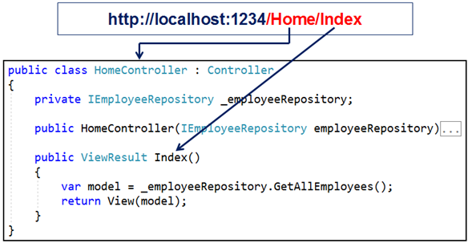
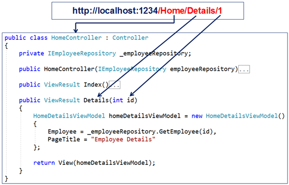

# Routing

- There are two routing  techniques in .NET
  - **Conventional Routing**
  - **Attribute Routing**
- The Controleer in .NET Web API, handles the incoming http request and responds to the user action.
- The incoming request URL is mapped to a controller action method. This mapping is done by the routing rules defined in our application.
- For example, when a request is issued to */Home/index*, this URL is mapped to the **Index()** action method in the **HomeController** class.
  
- Another example, when a request is issued to */Home/Details/1*, this URL is mapped to the **Details()** action method in the HomeController class. The value 1 in the URL is automatically mapped to the **"id"** parameter of the **Details(int id)** action method.
  
- Since we didn’t configure any routing rules, the question is how we navigate to the controller and the action.
In the Porgram.cs file we can have the following code:
  ```c#
  var builder = WebApplication.CreateBuilder(args);
  var app = builder.Build();
  // Configure middleware here
  app.UseRouting();
  app.UseEndpoints(endpoints =>
  {
      endpoints.MapDefaultControllerRoute(); // Maps default conventional routes
  });
  app.Run();
  ```
 - if we want to use only attribute routing, we can call ***MapControllers*** instead of ***MapDefaultControllerRoute***. The *MapControllers()* is a shorthand method that combines UseRouting(), UseAuthorization(), and UseEndpoints(endpoints => { endpoints.MapControllers(); }); into a single call. It's a convenient way to add these middleware components if you're building a minimal API type of application where you don't need to configure other middleware components between routing and endpoints.
   ```c#
   app.MapControllers();
   ```
 - Thie ***MapController*** call enables **routing**, **authorization**, and map the **attribute-routed controllers**.
 - In order to define custom routes we can use the following:
   ```c#
   var builder = WebApplication.CreateBuilder(args);
   var app = builder.Build();
   // Configure middleware here
   app.UseRouting();
   app.UseEndpoints(endpoints =>
   {
       endpoints.MapControllerRoute(
           name: "myRoute",
           pattern: "{controller=Home}/{action=Index}/{id?}");
   });
   app.Run();
   ```
 - Pay attention of the **?** after the *id* paramater, which makes it optional.

#### Arrribute Routing

- With attribute routing, we use the **Route** attribute to define our routes. We could apply the Route attribute on the Controller or on the Controller Action Methods.
- The Route() attribute is specified 2 times on the *GetAllEmployees()* action method. With each instance of the Route() attribute we specified a different route template. With these two routes templates in place, the *GetAllEmployees()* action method of the **EmployeeController** will be executed for any of the following two URL paths:
  - /employee
  - /employee/all
  ```c#
  [HttpGet]
  [Route("")]
  [Route("all")]
  public IActionResult GetAllEmployees()
  {
      return Ok(_employeeRepository.GetAllEmployees());
  }  
  ```
 - Of course we can specify paremeters in *attribute routing* as in the following method:
   ```c#
   [HttpGet]
   [Route("{id:int}", Name = "GetSpecificEmployee")]
   public IActionResult GetEmployeeById(int id)
   {
       Employee? employee = _employeeRepository.GetEmployeeById(id);
       if (employee != null)
           return Ok(employee);
       else
           return BadRequest($"No Employee with  Id: {id}");
   }
   ```
  - Route attribute can include several elemente in the Route:
    ```c#
    [Route("specific/{id:int}"])
    ```
  - If we want specific action to be executed when we navigate to the root URL with need to add **'/'** to the route rules:
    ```c#
    [Route("/"])
    ```
  - Attribute routes support token replacement by enclosing a token in square-braces ([ ]). The tokens **[controller]** and **[action]** are replaced with the values of the controller name and action name where the route is defined. 
  
  #### Conventional Routing vs Attribute Routing
  With attribute routing, routes are placed next to the action methods that will actually use them. Attribute routes offer a bit more flexibility than conventional routes. However, in general, conventional routes are used for controllers that serve HTML pages, and attribute routes for controllers that serve REST APIs. However, there is nothing stopping us from mixing conventional routing with attribute routing in a single application to get a bit more flexibility with routes.
  


**Bibliography:**


[](https://www.youtube.com/watch?v=ZoxrbrHjj2g&list=PL6n9fhu94yhVkdrusLaQsfERmL_Jh4XmU&index=33&t=1s)

[](https://www.youtube.com/watch?v=prNptonJAiY&list=PL6n9fhu94yhVkdrusLaQsfERmL_Jh4XmU&index=33)

[Back to Table of Content](../README.md#02-webapi-basic-conceptes) 